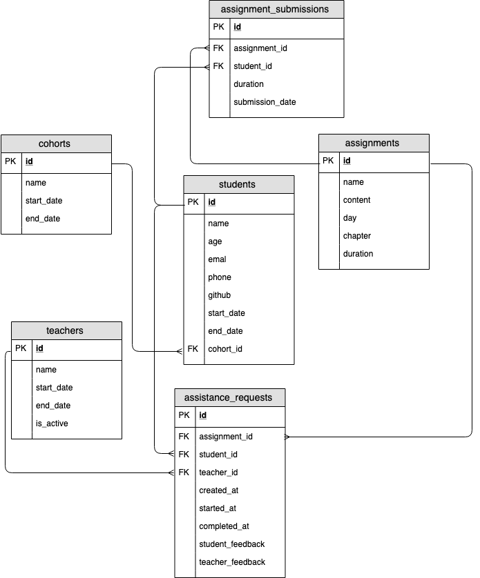

### BootCampX

his application is currently under the project code name **BootCampX**. The app will allow our staff to help students and mentors better and faster by offering quick insight into data like assignment completion and the effectiveness of assistance requests


**In this activity, we will:**
- Setup the project
- Create a database
- Add some tables to the database
- Add some data to the tables

For the BootCampX project, you will be responsible for writing all of the queries to get data from the database. That means writing a lot of `SELECT` statements, without having to worry about any JavaScript, HTML, or CSS. Once we have all of the queries written, the other devs can connect the backend, front end, and database together to complete the application

#### The Entities
**The main entities for this application will be:**
- `students`
- `cohorts`
- `assignments`
- `assignment_submissions`
- `teachers`
- `assistance_requests`

We're going to start off simple and just focus on the queries for two entities:
`students` and `cohorts`

**A cohort will have the following attributes:**
- `id` A unique identifier
- `name` The name of the cohort
- `start_date` The cohorts' start date
- `end_date` The cohorts' end date

**A student will have the following attributes:**
- `id` A unique identifier
- `name` The full name of the student
- `email` The students' email address
- `phone` The students' phone number
- `github` The students' github profile url
- `start_date` The students' start date of the Bootcamp
- `end_date` The students' end date of the Bootcamp
- `cohort_id` The id of the cohort that the student is enrolled in

We can model these entities in an Entity Relation Diagram (ERD):


##### Initialization of DB

So we start a new session

    psql

```postgresql
-- Create the database
CREATE DATABASE bootcampx;
-- Start using the database
\c bootcampx;
```
!!! important Note
    You will have to enter [[ \c ]] `bootcampx` every time you enter a new psql session to make sure that you're using the correct database


in the `migrations` folder is where you can initiate the tables, structure and data

From your `psql` session, type `\i migrations/students_cohorts.sql`
Now enter`\dt` into your `psql` session to make sure the two tables have been created

###### Assignments

Next entities are `assignment` and `assignment_submission`

Here is the ERD
{style="filter:invert(0.8)"}

###### Teachers and Assistance Request

**A `teacher` will have the following attributes**

- `id` A unique identifier
- `name` The name of the teacher
- `start_date` The date that the teacher started working.
- `end_date` The date that the teacher stopped working.
- `is_active` If the teacher is actively teaching right now.

**An `assistance_requests` will have the following attributes**
- `id` A unique identifier
- `assignment_id` The id of the assignment the request was made from
- `student_id` The id of the student making the request
- `teacher_id` The id of the teacher responding to the request
- `created_at` The timestamp when the request was made
- `started_at` The timestamp when the assistance started
completed_at: The timestamp when the assistance was completed
- `student_feedback` Feedback about the student given by the teacher
- `teacher_feedback` Feedback about the teacher given by the student

> A `student` can create many `assistance_requests` and a `teacher` can respond to many `assistance_requests`
>
> 